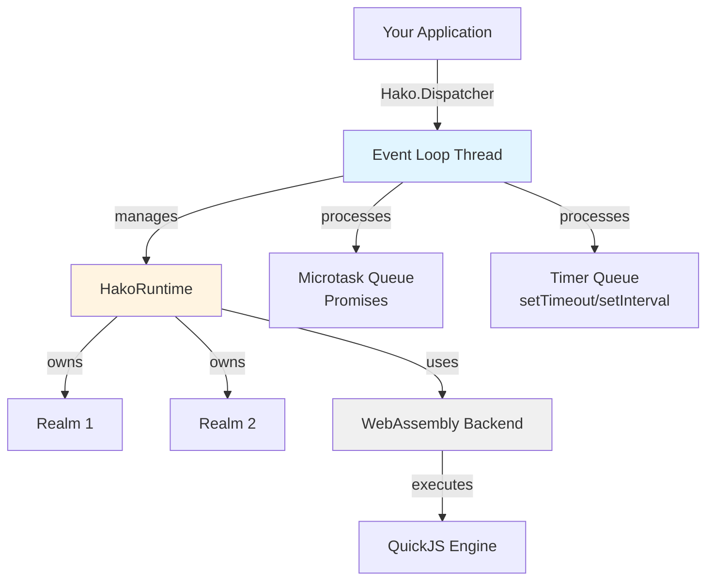

# Hako

Hako, a standalone and embeddable JavaScript engine. Hako enables .NET code to run JavaScript/TypeScript in a secure sandbox.

## Installation

```bash
dotnet add package Hako
dotnet add package Hako.Backend.Wasmtime  # or Hako.Backend.WACS
```

Requires .NET 9.0+ and a WebAssembly backend (Wasmtime recommended).

## Quick Start

```csharp
using HakoJS;
using HakoJS.Backend.Wasmtime;
using HakoJS.Extensions;

// Initialize runtime (creates event loop thread)
var runtime = Hako.Initialize<WasmtimeEngine>();

// Create execution context
using var realm = runtime.CreateRealm();

// Execute JavaScript
var result = await realm.EvalAsync<int>("2 + 2");
Console.WriteLine(result); // 4

// Clean shutdown
await Hako.ShutdownAsync();
```

## Core Architecture

Hako runs QuickJS (a compact ES2020+ JavaScript engine) compiled to WebAssembly. The architecture enforces single-threaded execution via a dedicated event loop:



### Components

**HakoRuntime**
Top-level container managing QuickJS runtime, memory limits, module loaders, and interrupt handlers.

**Realm**
Isolated JavaScript execution context with independent global scope, prototype chain, and module namespace. Multiple realms can exist within a runtime.

**Event Loop**
Dedicated background thread processing JavaScript microtasks (promise callbacks) and macrotasks (timers). All JavaScript operations are marshalled to this thread.

**JSValue**
Reference-counted handle to JavaScript values. Must be explicitly disposed to prevent memory leaks.

## Threading Model

QuickJS is single-threaded. Hako enforces this via a dedicated event loop thread and automatic marshalling.

### Dispatcher Pattern

All JavaScript operations execute on the event loop thread:

```csharp
// From any thread - automatically marshalled
var result = await realm.EvalAsync<int>("2 + 2");

// Check if on event loop thread
if (Hako.Dispatcher.CheckAccess())
{
    // Direct execution (already on event loop)
}

// Explicitly invoke on event loop
await Hako.Dispatcher.InvokeAsync(async () =>
{
    return await realm.EvalAsync("someCode()");
});
```

The dispatcher blocks calling threads until work completes on the event loop. This is transparent for most operations.

### Event Loop Execution Order

1. Process all queued work items (from `InvokeAsync`)
2. Flush microtask queue completely (promise callbacks)
3. Execute one macrotask if due (timer callback)
4. Repeat until idle
5. Wait for next work item or timer

## Value Lifecycle

All `JSValue` instances use reference counting and **must be disposed**:

```csharp
// Owned reference - you must dispose
using var obj = realm.NewObject();
obj.SetProperty("name", "Alice");

// Property access returns owned reference
using var name = obj.GetProperty("name");
Console.WriteLine(name.AsString());

// Function calls return owned references
using var func = realm.NewFunction("f", (ctx, _, args) => ctx.NewNumber(42));
using var result = func.Invoke();
```

### Borrowed References

Built-in constants return borrowed references (no disposal needed):

```csharp
var t = realm.True();
var f = realm.False();
var n = realm.Null();
var u = realm.Undefined();
// Don't dispose these - they're borrowed
```

### Scoped Disposal

Automatically dispose multiple values:

```csharp
var sum = realm.UseScope((r, scope) =>
{
    var arr = scope.Defer(r.NewArray());
    arr.SetProperty("0", 10);
    arr.SetProperty("1", 20);

    var len = scope.Defer(arr.GetProperty("length"));
    return len.AsNumber();
});
// All deferred values disposed in LIFO order
```

Async version:

```csharp
await realm.UseScopeAsync(async (r, scope) =>
{
    var result = scope.Defer(await r.EvalAsync("fetchData()"));
    return result.AsNumber();
});
```

### Extending Lifetimes

```csharp
JSValue CreateAndReturn()
{
    using var obj = realm.NewObject();
    using var prop = obj.GetProperty("value");

    // Dup() creates independent owned reference
    return prop.Dup();
}

using var value = CreateAndReturn();
```

## Realms

A **Realm** is an independent JavaScript execution context:

```csharp
using var realm1 = runtime.CreateRealm();
using var realm2 = runtime.CreateRealm();

await realm1.EvalAsync("globalThis.x = 10");
await realm2.EvalAsync("globalThis.x = 20");

var x1 = await realm1.EvalAsync<int>("x"); // 10
var x2 = await realm2.EvalAsync<int>("x"); // 20
```

Each realm has:
- Separate global object
- Independent prototype chain
- Own module namespace
- Isolated timer state

Realms share the parent runtime's memory limit and interrupt handlers.

### Realm Configuration

```csharp
var realm = runtime.CreateRealm(new RealmOptions
{
    Intrinsics = RealmOptions.RealmIntrinsics.Standard
    // Standard: Full ES2020+ built-ins
    // Minimal: Reduced built-ins
});
```

## Code Execution

### Evaluation Modes

```csharp
// Script mode (default) - no import/export
using var result = realm.EvalCode("2 + 2");
var value = result.Unwrap().AsNumber();

// Module mode - ES6 imports/exports allowed
await realm.EvalAsync(@"
    export const value = 42;
", new RealmEvalOptions { Type = EvalType.Module });
```

### Type-Safe Evaluation

```csharp
// Generic evaluation with type conversion
int num = await realm.EvalAsync<int>("21 + 21");
string text = await realm.EvalAsync<string>("'Hello ' + 'World'");
bool flag = await realm.EvalAsync<bool>("true");

var dict = await realm.EvalAsync("({ name: 'Alice', age: 30 })");
var name = dict.GetPropertyOrDefault<string>("name");
```

### Promise Resolution

`EvalAsync` automatically awaits promises:

```csharp
// Returns 42, not a promise
var result = await realm.EvalAsync<int>(@"
    new Promise(resolve => setTimeout(() => resolve(42), 100))
");
```

Manual promise handling:

```csharp
using var promise = realm.EvalCode("fetch(url)").Unwrap();

var state = promise.GetPromiseState(); // Pending, Fulfilled, Rejected

if (state == PromiseState.Pending)
{
    var resolved = await realm.ResolvePromise(promise);
    if (resolved.TryGetSuccess(out var value))
    {
        Console.WriteLine(value.AsString());
        value.Dispose();
    }
}
```

### TypeScript

Files with `.ts` extension automatically strip type annotations:

```csharp
var result = await realm.EvalAsync<string>(@"
    interface User {
        name: string;
        age: number;
    }

    const user: User = { name: 'Alice', age: 30 };
    user.name
", new() { FileName = "script.ts" });
```

Manual stripping:

```csharp
var typescript = "const add = (a: number, b: number): number => a + b;";
var javascript = runtime.StripTypes(typescript);
using var result = realm.EvalCode(javascript);
```

Type stripping does **not** perform type checkingit only removes syntax.

## Host Functions

Expose .NET functionality to JavaScript using the builder pattern:

```csharp
var realm = runtime.CreateRealm().WithGlobals(g => g
    .WithFunction("add", (ctx, thisArg, args) =>
    {
        var a = args[0].AsNumber();
        var b = args[1].AsNumber();
        return ctx.NewNumber(a + b);
    })
    .WithFunctionAsync("fetchUser", async (ctx, thisArg, args) =>
    {
        var id = (int)args[0].AsNumber();
        var user = await database.GetUserAsync(id);

        var obj = ctx.NewObject();
        obj.SetProperty("id", user.Id);
        obj.SetProperty("name", user.Name);
        return obj;
    })
    .WithValue("config", new Dictionary<string, object>
    {
        ["apiUrl"] = "https://api.example.com",
        ["timeout"] = 5000
    }));

await realm.EvalAsync(@"
    console.log('2 + 3 =', add(2, 3));
    const user = await fetchUser(42);
    console.log(user.name);
");
```

### Console Output

`console.log` is **not** built-in. Add it via `WithConsole()`:

```csharp
var realm = runtime.CreateRealm().WithGlobals(g => g.WithConsole());

await realm.EvalAsync("console.log('Hello, World!')");
// Output: Hello, World!

await realm.EvalAsync("console.error('Something failed')");
// Output (red): Something failed
```

Without `WithConsole()`:

```csharp
var realm = runtime.CreateRealm();
await realm.EvalAsync("console.log('hi')");
// Error: console is not defined
```

Custom console implementation:

```csharp
realm.WithGlobals(g => g.WithFunction("log", (ctx, _, args) =>
{
    foreach (var arg in args)
        Console.Write(arg.AsString() + " ");
    Console.WriteLine();
    return null; // returns undefined
}));
```

### Timers

`setTimeout`/`setInterval` require `WithTimers()`:

```csharp
var realm = runtime.CreateRealm().WithGlobals(g => g
    .WithConsole()
    .WithTimers());

await realm.EvalAsync(@"
    let count = 0;
    const id = setInterval(() => {
        console.log('tick', ++count);
        if (count >= 3) clearInterval(id);
    }, 100);
");
```

## Functions

### Creating Functions

```csharp
// Synchronous function
using var add = realm.NewFunction("add", (ctx, thisArg, args) =>
{
    var a = args[0].AsNumber();
    var b = args[1].AsNumber();
    return ctx.NewNumber(a + b);
});

// Returns undefined
using var logger = realm.NewFunction("log", (ctx, thisArg, args) =>
{
    Console.WriteLine(args[0].AsString());
    return null;
});

// Async function (returns Promise)
using var sleep = realm.NewFunctionAsync("sleep", async (ctx, thisArg, args) =>
{
    var ms = (int)args[0].AsNumber();
    await Task.Delay(ms);
    return ctx.NewString("done");
});
```

### Invoking Functions

```csharp
using var func = await realm.EvalAsync("(x, y) => x + y");

// Direct invocation
using var result = func.Invoke(5, 3);
Console.WriteLine(result.AsNumber()); // 8

// Type-safe invocation
var sum = func.Invoke<double>(5, 3);

// Async invocation (awaits if function returns promise)
var asyncResult = await func.InvokeAsync<int>(5, 3);
```

### Binding 'this'

```csharp
using var obj = realm.NewObject();
obj.SetProperty("value", 10);

using var getThis = realm.NewFunction("getThis", (ctx, thisArg, args) =>
{
    return thisArg.GetProperty("value");
});

// Bind 'this' to obj
using var bound = getThis.Bind(obj);
using var result = bound.Invoke();
Console.WriteLine(result.AsNumber()); // 10
```

## Values and Types

### Creating Values

```csharp
// Primitives
using var num = realm.NewNumber(3.14);
using var str = realm.NewString("text");
using var bool_ = realm.True(); // Borrowed - don't dispose

// Objects
using var obj = realm.NewObject();
obj.SetProperty("x", 10);
obj.SetProperty("y", 20);

// Arrays
using var arr = realm.NewArray();
arr.SetProperty(0, 1);
arr.SetProperty(1, 2);
arr.SetProperty("length", 2);

// Convert from .NET
using var converted = realm.NewValue(new Dictionary<string, object>
{
    ["name"] = "Alice",
    ["items"] = new[] { 1, 2, 3 },
    ["active"] = true
});
```

### Type Checking

```csharp
using var value = await realm.EvalAsync("42");

JSType type = value.Type; // JSType.Number
bool isNumber = value.IsNumber();
bool isString = value.IsString();
bool isObject = value.IsObject();
bool isArray = value.IsArray();
bool isFunction = value.IsFunction();
bool isPromise = value.IsPromise();
```

### Type Conversion

```csharp
using var value = await realm.EvalAsync("42");

// Safe conversion
if (value.IsNumber())
{
    double num = value.AsNumber();
}

// Generic conversion (throws if incompatible)
int i = value.ToNativeValue<int>();
long l = value.ToNativeValue<long>();
string s = value.ToNativeValue<string>();

// Safe try pattern
var tuple = value.TryGetProperty<string>("name");
if (tuple.HasValue)
{
    Console.WriteLine(tuple.Value);
}
```

### Property Access

```csharp
using var obj = realm.NewObject();

// Set properties
obj.SetProperty("name", "Alice");
obj.SetProperty("age", 30);

// Get properties (returns owned reference)
using var name = obj.GetProperty("name");
using var age = obj.GetProperty("age");

// Check existence
bool hasName = obj.HasProperty("name");

// Delete
bool deleted = obj.DeleteProperty("age");

// Symbol keys
using var sym = realm.GetWellKnownSymbol("iterator");
using var iterator = obj.GetProperty(sym);
```

### TypedArrays

```csharp
// Create typed arrays
using var uint8 = realm.NewUint8Array(new byte[] { 1, 2, 3, 4 });
using var float64 = realm.NewFloat64Array(new[] { 1.5, 2.5, 3.5 });
using var int32 = realm.NewInt32Array(new[] { 10, 20, 30 });

// Access backing buffer
var buffer = uint8.CopyTypedArray();

// Create view on existing buffer
using var view = realm.NewTypedArrayWithBuffer(
    buffer,
    byteOffset: 0,
    length: 4,
    TypedArrayType.Uint8Array
);
```

## Module System

### Module Loader

```csharp
runtime.EnableModuleLoader((runtime, realm, moduleName, attributes) =>
{
    return moduleName switch
    {
        "utils" => ModuleLoaderResult.Source(@"
            export const add = (a, b) => a + b;
            export const mul = (a, b) => a * b;
        "),

        "config" => ModuleLoaderResult.Source(@"
            export default { host: 'localhost', port: 3000 };
        "),

        _ => ModuleLoaderResult.Error()
    };
});

var module = await realm.EvalAsync(@"
    import { add } from 'utils';
    import config from 'config';

    export const result = add(config.port, 42);
", new() { Type = EvalType.Module });

using var result = module.GetProperty("result");
Console.WriteLine(result.AsNumber()); // 3042
```

### File-Based Modules

```csharp
runtime.EnableModuleLoader((rt, realm, moduleName, attrs) =>
{
    var path = moduleName.EndsWith(".js") ? moduleName : $"{moduleName}.js";

    if (!File.Exists(path))
        return ModuleLoaderResult.Error();

    var source = File.ReadAllText(path);

    // Strip TypeScript if .ts extension
    if (path.EndsWith(".ts"))
        source = rt.StripTypes(source);

    return ModuleLoaderResult.Source(source);
});
```

### JSON Modules

```csharp
var packageJson = File.ReadAllText("package.json");

runtime.ConfigureModules()
    .WithJsonModule("package.json", packageJson)
    .Apply();

await realm.EvalAsync(@"
    import pkg from 'package.json' with { type: 'json' };
    console.log(pkg.name, pkg.version);
");
```

### Native C Modules

C Modules expose .NET code as native ES6 modules:

```csharp
var mathModule = runtime.CreateCModule("math", init =>
{
    var realm = runtime.GetSystemRealm();

    init.SetExport("PI", realm.NewNumber(Math.PI));
    init.SetExport("sqrt", realm.NewFunction("sqrt", (ctx, _, args) =>
    {
        var n = args[0].AsNumber();
        return ctx.NewNumber(Math.Sqrt(n));
    }));
})
.AddExports("PI", "sqrt");

runtime.EnableModuleLoader((rt, realm, moduleName, attrs) =>
{
    if (moduleName == "math")
        return ModuleLoaderResult.Precompiled(mathModule.Pointer);
    return ModuleLoaderResult.Error();
});

await realm.EvalAsync(@"
    import { PI, sqrt } from 'math';
    console.log(sqrt(PI * PI));
");
```

### Module Builder

Chain multiple loaders:

```csharp
runtime.ConfigureModules()
    .AddLoader((rt, realm, name, attrs) =>
    {
        if (name.StartsWith("@app/"))
        {
            var file = name.Replace("@app/", "src/") + ".js";
            if (File.Exists(file))
                return ModuleLoaderResult.Source(File.ReadAllText(file));
        }
        return null; // Fall through
    })
    .WithJsonModule("config.json", configJson)
    .Apply();
```

## Class Bindings

Use source generators to expose .NET classes:

```csharp
using HakoJS.SourceGeneration;

[JSClass(Name = "Point")]
public partial class Point
{
    [JSConstructor]
    public Point(double x = 0, double y = 0)
    {
        X = x;
        Y = y;
    }

    [JSProperty(Name = "x")]
    public double X { get; set; }

    [JSProperty(Name = "y")]
    public double Y { get; set; }

    [JSMethod(Name = "distanceTo")]
    public double DistanceTo(Point other)
    {
        var dx = X - other.X;
        var dy = Y - other.Y;
        return Math.Sqrt(dx * dx + dy * dy);
    }

    [JSMethod(Name = "toString")]
    public override string ToString() => $"Point({X}, {Y})";

    [JSMethod(Name = "midpoint", Static = true)]
    public static Point Midpoint(Point a, Point b) =>
        new((a.X + b.X) / 2, (a.Y + b.Y) / 2);
}
```

Register and use:

```csharp
realm.RegisterClass<Point>();

await realm.EvalAsync(@"
    const p1 = new Point(3, 4);
    const p2 = new Point(6, 8);

    console.log(p1.toString());
    console.log('Distance:', p1.distanceTo(p2));

    const mid = Point.midpoint(p1, p2);
    console.log('Midpoint:', mid.x, mid.y);
");
```

Bidirectional conversion:

```csharp
// JS � C#
var jsPoint = await realm.EvalAsync("new Point(10, 20)");
var csPoint = jsPoint.ToInstance<Point>();
Console.WriteLine($"X={csPoint.X}, Y={csPoint.Y}");
jsPoint.Dispose();

// C# � JS
var point = new Point(5, 15);
using var jsValue = point.ToJSValue(realm);
var distance = await jsValue.GetProperty("distanceTo")
    .InvokeAsync<double>(new Point(0, 0));
```

### Object Marshaling

Marshal plain objects using records:

```csharp
[JSObject]
public partial record UserConfig(
    string Name,
    int Age,
    [JSPropertyName("email_address")] string EmailAddress,
    Action<string>? OnNotify = null
);

// C# � JS
var config = new UserConfig("Alice", 30, "alice@example.com");
using var jsConfig = config.ToJSValue(realm);

// JS � C#
var jsObj = await realm.EvalAsync(@"
    ({ name: 'Bob', age: 25, email_address: 'bob@example.com' })
");
using var csConfig = UserConfig.FromJSValue(realm, jsObj);
Console.WriteLine(csConfig.Name); // Bob
```

## Promises

### Creating Promises

```csharp
using var promise = realm.NewPromise();

Task.Run(async () =>
{
    await Task.Delay(500);

    // Must be on event loop thread to resolve
    await Hako.Dispatcher.InvokeAsync(() =>
    {
        using var result = realm.NewString("Done");
        promise.Resolve(result);
    });
});

// Return to JavaScript
realm.GetGlobalObject().SetProperty("myPromise", promise.Handle);
```

### Tracking Unhandled Rejections

```csharp
runtime.OnUnhandledRejection((realm, promise, reason, isHandled, opaque) =>
{
    if (!isHandled)
    {
        Console.WriteLine($"Unhandled rejection: {reason.AsString()}");
    }
});

await realm.EvalAsync(@"
    Promise.reject(new Error('Oops'));
");
// Logs: Unhandled rejection: Error: Oops
```

## Safety and Limits

### Memory Limits

```csharp
var runtime = Hako.Initialize<WasmtimeEngine>(opts =>
{
    opts.MemoryLimitBytes = 10 * 1024 * 1024; // 10MB
});

// Or set at runtime
runtime.SetMemoryLimit(50 * 1024 * 1024);

// Monitor usage
var usage = runtime.ComputeMemoryUsage(realm);
Console.WriteLine($"Used: {usage.MemoryUsedSize} bytes");
Console.WriteLine($"Objects: {usage.ObjectCount}");

// Force GC
runtime.RunGC();
```

### Execution Timeouts

```csharp
// Time-based limit (5 seconds)
var handler = HakoRuntime.CreateDeadlineInterruptHandler(5000);
runtime.EnableInterruptHandler(handler);

try
{
    await realm.EvalAsync("while(true) {}");
}
catch (HakoException)
{
    Console.WriteLine("Execution interrupted");
}
finally
{
    runtime.DisableInterruptHandler();
}
```

### Operation Limits

```csharp
// Limit total operations
var gasHandler = HakoRuntime.CreateGasInterruptHandler(100_000);
runtime.EnableInterruptHandler(gasHandler);
```

### Combined Limits

```csharp
var combined = HakoRuntime.CombineInterruptHandlers(
    HakoRuntime.CreateDeadlineInterruptHandler(5000),
    HakoRuntime.CreateMemoryInterruptHandler(10_000_000),
    HakoRuntime.CreateGasInterruptHandler(100_000)
);

runtime.EnableInterruptHandler(combined);
```

## Error Handling

### JavaScript Exceptions

```csharp
using var result = realm.EvalCode("throw new Error('Failed')");

if (result.TryGetFailure(out var error))
{
    Console.WriteLine(error.AsString());

    // Stack trace
    using var stack = error.GetProperty("stack");
    Console.WriteLine(stack.AsString());

    // Error details
    using var name = error.GetProperty("name");
    using var message = error.GetProperty("message");

    error.Dispose();
}
```

### Throwing from .NET

```csharp
realm.WithGlobals(g => g.WithFunction("fail", (ctx, _, args) =>
{
    // Typed error
    return ctx.ThrowError(JSErrorType.TypeError, "Invalid type");

    // Or from exception
    // return ctx.ThrowError(new ArgumentException("Bad arg"));
}));
```

### DisposableResult Pattern

```csharp
using var evalResult = realm.EvalCode("2 + 2");

if (evalResult.TryGetSuccess(out var value))
{
    Console.WriteLine(value.AsNumber());
    value.Dispose();
}
else if (evalResult.TryGetFailure(out var error))
{
    Console.WriteLine($"Error: {error.AsString()}");
    error.Dispose();
}

// Or unwrap (throws on failure)
using var value = realm.EvalCode("2 + 2").Unwrap();
```

## Iterators

### Synchronous Iteration

```csharp
// Type-safe iteration with automatic conversion
using var array = await realm.EvalAsync("[1, 2, 3, 4, 5]");

foreach (var number in array.Iterate<double>())
{
    Console.WriteLine(number);
}

// Or manual disposal for full control
foreach (var itemResult in array.Iterate())
{
    if (itemResult.TryGetSuccess(out var item))
    {
        using (item)
        {
            Console.WriteLine(item.AsNumber());
        }
    }
}
```

### Async Iteration

```csharp
var asyncIterable = await realm.EvalAsync(@"
    async function* gen() {
        for (let i = 0; i < 5; i++) {
            yield i;
        }
    }
    gen()
");

// Type-safe async iteration
await foreach (var number in asyncIterable.IterateAsync<int>())
{
    Console.WriteLine(number);
}
```

### Specialized Iterators

```csharp
// Iterate Map
var map = await realm.EvalAsync(@"
    new Map([['a', 1], ['b', 2], ['c', 3]])
");

foreach (var kvp in map.IterateMap<string, int>())
{
    Console.WriteLine($"{kvp.Key}: {kvp.Value}");
}

// Iterate Set
var set = await realm.EvalAsync("new Set([10, 20, 30])");

foreach (var value in set.IterateSet<int>())
{
    Console.WriteLine(value);
}
```

## Bytecode Compilation

Pre-compile JavaScript for faster execution:

```csharp
using var bytecodeResult = realm.CompileToByteCode(@"
    function factorial(n) {
        return n <= 1 ? 1 : n * factorial(n - 1);
    }
    factorial(10);
");

if (bytecodeResult.TryGetSuccess(out var bytecode))
{
    File.WriteAllBytes("script.qbc", bytecode);

    // Execute bytecode
    var loaded = File.ReadAllBytes("script.qbc");
    using var result = realm.EvalByteCode(loaded);
    Console.WriteLine(result.Unwrap().AsNumber());
}
```

Configure bytecode stripping:

```csharp
runtime.SetStripInfo(new StripOptions
{
    StripDebug = true,   // Remove debug info
    StripSource = false  // Keep source for stack traces
});
```

Bytecode is **not** portable across QuickJS versions.

## Advanced Topics

### JSON Operations

```csharp
// Parse JSON
using var parsed = realm.ParseJson(@"{ ""name"": ""Alice"" }");
Console.WriteLine(parsed.GetPropertyOrDefault<string>("name"));

// Binary JSON (QuickJS format)
using var obj = realm.NewObject();
obj.SetProperty("data", realm.NewNumber(42));

byte[] bjson = realm.BJSONEncode(obj);
File.WriteAllBytes("data.bjson", bjson);

var loaded = File.ReadAllBytes("data.bjson");
using var decoded = realm.BJSONDecode(loaded);
```

### Opaque Data

Associate metadata with realms:

```csharp
realm.SetOpaqueData("tenant-123");
string? tenantId = realm.GetOpaqueData();
```

### Debug Helpers

```csharp
// Dump value structure
using var obj = await realm.EvalAsync("({ a: [1, 2], b: { c: 3 } })");
Console.WriteLine(realm.Dump(obj));

// Memory diagnostics
var usage = runtime.ComputeMemoryUsage(realm);
Console.WriteLine($"Memory: {usage.MemoryUsedSize} bytes");
Console.WriteLine($"Objects: {usage.ObjectCount}");

var dump = runtime.DumpMemoryUsage();
Console.WriteLine(dump);
```

## Common Patterns

### Resource Management

```csharp
//  Correct - using statement
using var value = realm.NewNumber(42);

//  Correct - try/finally
var obj = realm.NewObject();
try
{
    obj.SetProperty("x", 10);
}
finally
{
    obj.Dispose();
}

//  Best - scoped disposal
realm.UseScope((r, scope) =>
{
    var obj = scope.Defer(r.NewObject());
    var prop = scope.Defer(obj.GetProperty("x"));
    return prop.AsNumber();
});
```

### Safe Property Access

```csharp
using var obj = await realm.EvalAsync("({ name: 'Alice', age: 30 })");

// Extension method - safe property access with default
var name = obj.GetPropertyOrDefault<string>("name", "Unknown");
var age = obj.GetPropertyOrDefault<int>("age", 0);

// Try pattern (returns NativeBox<T>)
var nameTuple = obj.TryGetProperty<string>("name");
if (nameTuple != null)
{
    Console.WriteLine(nameTuple.Value);
    nameTuple.Dispose();
}

// Manual check before access
if (obj.HasProperty("email"))
{
    using var email = obj.GetProperty("email");
    Console.WriteLine(email.AsString());
}
```

### Minimizing Allocations

```csharp
//  Creates temporary JSValue per iteration
for (int i = 0; i < 1000; i++)
{
    await realm.EvalAsync($"process({i})");
}

//  Reuse function reference
using var process = await realm.EvalAsync("process");
for (int i = 0; i < 1000; i++)
{
    using var arg = realm.NewNumber(i);
    using var result = process.Invoke(arg);
}
```

## Gotchas

**Not disposing values**
```csharp
//  Memory leak
for (int i = 0; i < 1000; i++)
{
    var val = realm.NewObject(); // Never disposed!
}

//  Correct
for (int i = 0; i < 1000; i++)
{
    using var val = realm.NewObject();
}
```

**Using values after realm disposal**
```csharp
JSValue value;
using (var realm = runtime.CreateRealm())
{
    value = realm.NewString("hello").Dup();
}
value.AsString(); //  Throws - realm was disposed
```

**Forgetting WithConsole()**
```csharp
var realm = runtime.CreateRealm();
await realm.EvalAsync("console.log('hi')");
//  Error: console is not defined
```

**Blocking event loop**
```csharp
await Hako.Dispatcher.InvokeAsync(async () =>
{
    var result = await realm.EvalAsync("code");
    Thread.Sleep(1000); //  Blocks event loop!
});
```

## Type Reference

### Enums

**JSType**: `Undefined`, `Null`, `Boolean`, `Number`, `String`, `Symbol`, `Object`, `Function`, `Array`, `Error`, `Promise`, `ArrayBuffer`, `TypedArray`

**EvalType**: `Global` (script mode), `Module` (ES6 module)

**JSErrorType**: `Error`, `EvalError`, `RangeError`, `ReferenceError`, `SyntaxError`, `TypeError`, `URIError`, `InternalError`

**PromiseState**: `Pending`, `Fulfilled`, `Rejected`

**TypedArrayType**: `Int8Array`, `Uint8Array`, `Uint8ClampedArray`, `Int16Array`, `Uint16Array`, `Int32Array`, `Uint32Array`, `Float32Array`, `Float64Array`, `BigInt64Array`, `BigUint64Array`

---

**See Also:**
- [Hako.Backend.Wasmtime](http://github.com/6over3/hako/hosts/dotnet/Hako.Backend.Wasmtime/) - Wasmtime backend
- [Hako.Backend.WACS](http://github.com/6over3/hako/hosts/dotnet/Hako.Backend.WACS/) - WACS backend
- [Hako.SourceGenerator](http://github.com/6over3/hako/hosts/dotnet/Hako.SourceGenerator/) - Binding generator